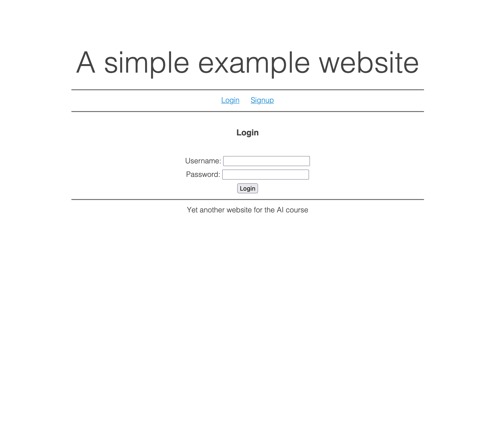
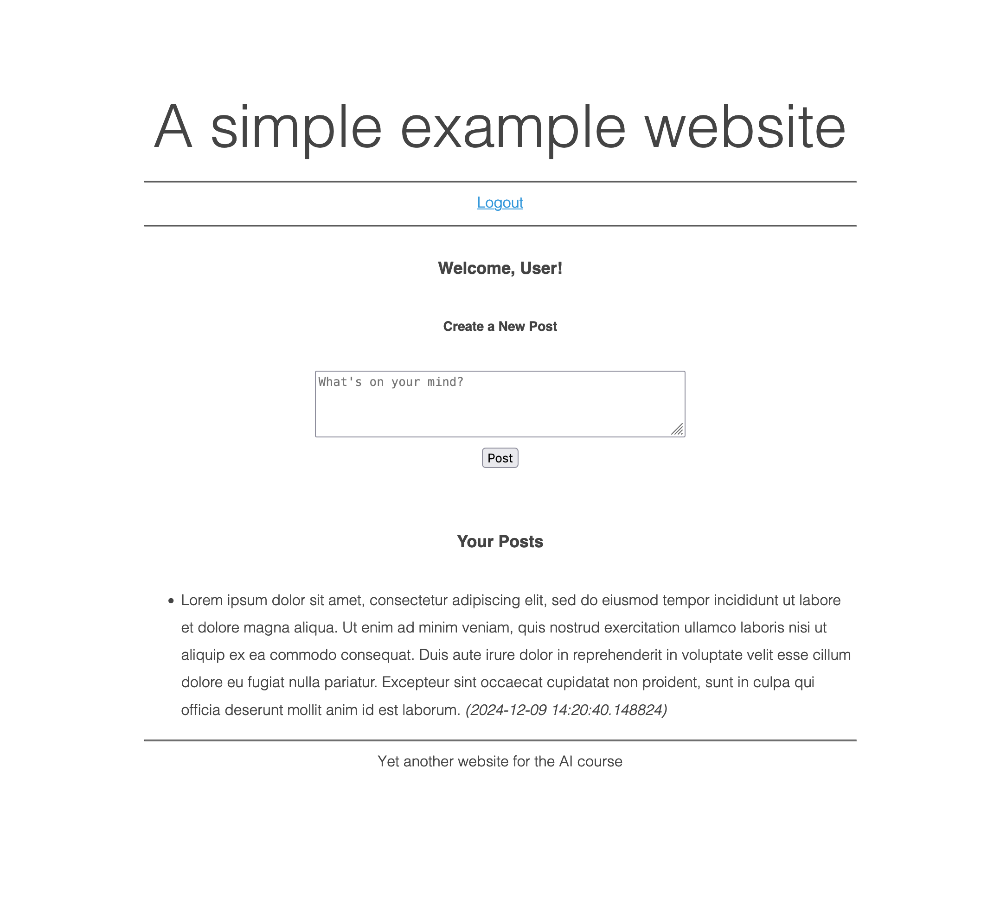

# PHP Example Website

This project shows how PHP can be used to build a simple web application.

## Screenshots

## Features

- User Registration: Users can create accounts with credentials.
- User Login: Authentication system with error handling.
- Private Notes: Logged-in users can create and view posts.
- Session Management: User sessions are managed using PHP sessions.

## Requirements

- PHP: 7.4 or higher
- PostgreSQL: 9.6 or higher
- A web server

## Usage

1. Clone the repository: `git clone https://github.com/DavideLoconte/php-example-website.git`;
2. Navigate to the project directory: `cd php-example-website`;
3. Configure the database:
    - Install PostgreSQL (if not already installed).
    - Update the `components/database.php` file with your database connection details.
    - Run `psql -f database.sql` to create the database and tables.
4. Start the web server: `php -S localhost:8000`;

Alternatively, you can use a web server like Apache or Nginx to host the project.

## Key Directories and Files

Key Directories and Files

- `actions/`: Contains backend scripts that handle user requests (e.g., login, signup, posting notes).
- `components/`: Contains reusable PHP components for modular development (e.g., database connection, header, footer).
- `database.sql`: Defines the database schema for the website, including tables for users and private notes.
- `index.php`: The main entry point or homepage of the website.
- `login.php` and `signup.php`: Dedicated pages for user login and registration.

## Acknowledgments

- [PHP Documentation](https://www.php.net/)
- [PostgreSQL Documentation](https://www.postgresql.org/docs/current/)
- [Air CSS](https://github.com/markdowncss/air)

## License
This project is licensed under the [MIT License](LICENSE).
